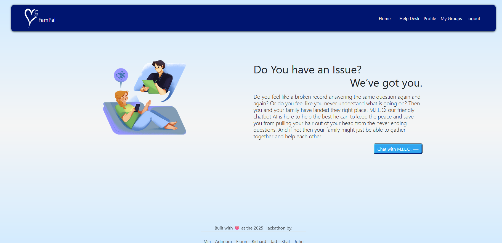

  

# FamPal

FamPal is an AI-powered help desk designed to assist families with everyday tasks, offering quick answers, smart suggestions, and friendly support whenever it's needed.

## [FamPal Live Website](https://fampal-d6a25660fc9b.herokuapp.com/)

## Table of Content

## Project Goals

FamPal is a web-based help desk designed for families. It enables users to create and manage private family groups where they can ask questions, offer support, and collaborate more effectively. The platform integrates AI to assist users with quick answers and smart suggestions. The goal is to provide a safe and simple space for families to get help and stay connected.

### Primary Goals
- Provide a simple and secure way for users to create family groups.
- Encourage collaboration by allowing family members to ask and answer questions.
- Integrate AI assistance for quick and intelligent support.
- Deliver a clean, responsive, and user-friendly experience across all devices.

### User Goals
- As a user, I want to create an account.
- As a user, I want to log in.
- As a user, I want to log out.
- As a user, I want to recover my password if I forget it.
- As a user, I want to be able to create a family group.
- As a user, I want to be able to add new members to my family group.
- As a user, I want to be able to remove members from my family group.
- As a user, I want to be able to delete the family group I created.
- As a user, I want to ask questions.
- As a user, I want to receive help from my family group.
- As a user, I want to help answer other family members' questions.
- As a user, I want to talk to an AI assistant to get help.
- As a user, I want a simple and user-friendly interface.
- As a user, I want the app to work well on mobile and desktop devices.

### Developer Goals
- As a developer, I want to create a fully responsive design across multiple devices.
- As a developer, I want to provide access to an admin area to manage users and content.
- As a developer, I want to integrate an AI chatbot in the help desk section.
- As a developer, I want to build an appealing and intuitive user interface.
- As a developer, I want to follow best practices in security, accessibility, and performance.
- As a developer, I want to deploy the application online for public access.
- As a developer, I want to make the codebase well-structured and easy to maintain.
- As a developer, I want to write clean and documented code.

## Acknowledgements

 - [Awesome Readme Templates](https://awesomeopensource.com/project/elangosundar/awesome-README-templates)
 - [Awesome README](https://github.com/matiassingers/awesome-readme)
 - [How to write a Good readme](https://bulldogjob.com/news/449-how-to-write-a-good-readme-for-your-github-project)

## Agile Planning

This project was developed using Agile methodology over the course of **5 days** by a team of **6 developers**. Planning and task management were conducted via **GitHub Projects**, using a **Kanban board** to organize user stories, development tasks, and testing workflows.

### Kanban Board
- 📍 GitHub Project Board: [View Board](https://github.com/users/xttrust/projects/13)

### Kanban Board Preview

We communicated and collaborated through **Slack**, which allowed us to stay in sync, share updates, and resolve blockers in real-time. Each team member was responsible for planning, coding, reviewing, and testing features based on assigned tasks. This structure ensured continuous delivery, transparency, and efficient teamwork throughout the sprint.
## Project Steps & Features

The development of FamPal included several key phases, each with specific features designed to meet user and business needs.

### 1. **Planning & Setup**
- Defined project goals and user stories using Agile methodology
- Created GitHub Project Kanban board for task management
- Assigned roles and responsibilities to all 6 developers
- Established team communication on Slack

### 2. **Environment & Tools**
- **Backend**: Django with PostgreSQL (deployed on Heroku)
- **Frontend**: HTML, CSS (Bootstrap), JavaScript
- **Authentication**: Django-Allauth for registration, login, logout, password recovery
- **AI Integration**: OpenAI API for AI-powered help desk
- **Version Control**: Git & GitHub

### 3. **Core Features Implemented**

#### ✅ **User Authentication**
- User registration, login, logout
- Secure password reset functionality

#### ✅ **User Profile**
- Personalized profile page showing:
  - User's own questions
  - Questions from their family group(s)
  - Ability to create, view, and delete questions

#### ✅ **Family Groups**
- Create a family group
- Add/remove members from the group
- Delete family groups created by the user

#### ✅ **Help Desk System**
- Post questions asking for help
- Browse questions from family group members
- Reply to others and collaborate within the group

#### ✅ **AI Chat Integration**
- Users can ask questions directly to an AI assistant
- Quick suggestions and support via OpenAI integration

#### ✅ **Admin Panel**
- Full Django admin dashboard for app management

### 4. **Responsive Design**
- Fully responsive design for desktop, tablet, and mobile devices
- Clean and accessible user interface using Bootstrap

### 5. **Deployment**
- Deployed on Heroku using PostgreSQL
- Static files handled with WhiteNoise
- Environment variables managed with `.env` for security

---

Each feature was built and tested collaboratively over the span of 5 days, ensuring both functionality and user experience were prioritized throughout the project.## User Stories

To ensure we delivered a user-focused product, we created user stories to guide development. Each story represents a goal or task a user wants to accomplish using the FamPal application.

### Epic: Authentication & Account Management
- As a user, I want to create an account so I can access the platform.
- As a user, I want to log in so I can access my personal dashboard.
- As a user, I want to log out to secure my account when I'm done.
- As a user, I want to reset my password in case I forget it.

### Epic: Profile & Personal Dashboard
- As a user, I want to view a personalized profile page with my questions and group activity.
- As a user, I want to see questions I’ve asked so I can track responses.
- As a user, I want to see questions from my group members so I can offer help.

### Epic: Group Management
- As a user, I want to create a family group so I can collaborate with my family.
- As a user, I want to add members to my group so we can help each other.
- As a user, I want to remove members from my group if needed.
- As a user, I want to delete the group I created if it’s no longer needed.

### Epic: Help System
- As a user, I want to post a question asking for help from my group.
- As a user, I want to reply to questions from group members to offer help.
- As a user, I want to get help from the group so I feel supported.

### Epic: AI Assistance
- As a user, I want to talk to an AI assistant to get quick advice or help.
- As a user, I want the AI to provide relevant and fast responses to my queries.

### Epic: Responsive Design & Accessibility
- As a user, I want to use the app on mobile, tablet, or desktop devices.
- As a user, I want a clean, intuitive interface that’s easy to navigate.

---

These user stories served as a blueprint during Agile development, helping the team prioritize functionality and user experience throughout the project.

## Features

FamPal is designed to be a responsive, family-focused help desk application. Below are the core features of the application, with screenshots included for both desktop and mobile experiences where relevant.

---

### 🔐 Authentication System

Users can sign up, log in, log out, and reset their passwords with ease.

- **Signup**

  
  

- **Login**

  
  

- **Logout**

  
  

- **Reset Password**

  
  

---

### 🧑‍💼 Profile Dashboard

Users can see an overview of their activity including their own questions and group questions.

- **Profile Page**

  
  

---

### 👨‍👩‍👧 Family Group Management

Users can create family groups, add or remove members, and delete their groups.

- **Groups Page**

  
  

---

### ❓ Help Desk System

Users can ask for help, browse questions from their group, and interact with an AI assistant for additional support.

- **Help Page**

  
  

- **Notifications**

  Get real-time notifications when there are new questions in your family group.

  

---

### 🤖 AI Chat Assistant

A smart assistant is available to offer instant help through natural language interaction.

- Integrated in the **Help Page** (see screenshots above)

---

### 🌐 Navigation

Clear and responsive navigation bar across all pages.

- **Navbar**

  
  

---

### 📦 Footer

Consistent and responsive footer across the site.

- **Footer**

  
  

---

All pages are built with responsiveness in mind, offering a seamless user experience on both mobile and desktop devices.

## 🧩 Wireframes

Before development began, wireframes were created to plan the layout and structure of the application across key pages. These wireframes guided the UI/UX decisions during implementation.

All wireframes were created with responsiveness in mind to ensure usability across devices.

### Home Page

---

### Login Page

---

### Signup Page

---

### Profile Page

---

### Help Desk Page

---

These wireframes served as a blueprint throughout the development process and helped maintain design consistency and functionality focus.
## 🛠️ Technologies Used

This project was built using a modern full-stack approach, combining Django with Bootstrap for a responsive, dynamic, and scalable application.

### ⚙️ Backend
- **Python** – Programming language used for backend development
- **Django** – Web framework used to build the main application logic
- **Django AllAuth** – Used for authentication (sign up, login, password reset)
- **SQLite** – Default development database
- **Gunicorn** – WSGI HTTP server for deploying Django apps
- **Whitenoise** – For serving static files in production

### 🤖 AI Integration
- **Botpress** – Conversational AI platform used to build the smart assistant
- **M.I.L.O** – Custom Botpress agent designed to assist users in the Help Desk with friendly, intelligent responses

### 🌐 Frontend
- **HTML5** – Markup language for structuring content
- **CSS3** – Styling with custom styles and Bootstrap utilities
- **Bootstrap 5** – Responsive design framework
- **JavaScript** – Used for minor interactivity

### ☁️ Hosting & Deployment
- **Heroku** – Platform used to host and deploy the application
- **GitHub** – Code hosting and version control
- **GitHub Projects** – Used for Agile planning and task tracking

### 🧪 Development Tools
- **VS Code** – Source-code editor
- **Slack** – Team communication during the Agile sprint
- **Google Chrome DevTools** – Debugging and responsive design testing

---

These tools and technologies were chosen for their simplicity, flexibility, and ease of integration, enabling rapid development and collaboration across a distributed team.
## 📚 Libraries Used

The project utilizes several external libraries and CDNs to enhance functionality and styling:

### 🧩 CSS Libraries
- **[Bootstrap 5.3.6](https://getbootstrap.com/)**  
  For responsive layout, grid system, and UI components.
- **[Bootstrap Icons 1.10.5](https://icons.getbootstrap.com/)**  
  Icon library compatible with Bootstrap.
- **[Font Awesome 6.7.2](https://fontawesome.com/)**  
  A rich set of icons used throughout the site.
- **[Animate.css 4.1.1](https://animate.style/)**  
  CSS animation library used to enhance visual feedback.
- **Custom CSS**  
  Additional project-specific styling located in `static/css/main.css`.

### 🧩 JavaScript Libraries
- **[jQuery 3.7.1](https://jquery.com/)**  
  Used for simple DOM manipulation and Bootstrap plugin support.

### 🎨 Assets
- **Favicon**  
  Located in `static/img/favicon.png`, used to visually identify the app in the browser tab.

These libraries were included via CDN for ease of use and fast loading during development and deployment.
## 🧪 Testing

### ✅ Manual Testing

The following features were manually tested across all main pages on both desktop and mobile devices. Each test passed successfully unless otherwise noted.

| Feature                        | Homepage | Help Desk | Profile | Login | Signup | Groups | Logout | Reset Password |
|-------------------------------|----------|-----------|---------|-------|--------|--------|--------|----------------|
| Page loads without errors     | ✅       | ✅        | ✅      | ✅    | ✅     | ✅     | ✅     | ✅             |
| Responsive layout             | ✅       | ✅        | ✅      | ✅    | ✅     | ✅     | ✅     | ✅             |
| Navigation works correctly    | ✅       | ✅        | ✅      | ✅    | ✅     | ✅     | ✅     | ✅             |
| Forms submit and validate     | ❌       | ✅        | ✅      | ✅    | ✅     | ✅     | ✅     | ✅             |
| Error handling (e.g., 404)    | ✅       | ✅        | ✅      | ✅    | ✅     | ✅     | ✅     | ✅             |
| User authentication flows     | ✅       | ✅        | ✅      | ✅    | ✅     | ✅     | ✅     | ✅             |
| AI Help Chat works            | ✅       | ✅        | N/A     | N/A   | N/A    | N/A    | N/A    | N/A            |
| Notifications appear as expected | ✅    | ✅        | ✅      | ✅    | ✅     | ✅     | ✅     | ✅             |

---

### 🖼️ HTML Validation (W3C)

The HTML of the main pages was validated using the [W3C Markup Validator](https://validator.w3.org/).  
All reported issues were reviewed and addressed.

#### Screenshots:
- 
- 
- 

---

### 🎨 CSS Validation

The main stylesheet was validated using the [W3C CSS Validator](https://jigsaw.w3.org/css-validator/).  
All styles passed the test successfully.

#### Screenshot:
- 

---

### ⚡ Lighthouse Performance Testing

Google Chrome's Lighthouse tool was used to assess performance, accessibility, best practices, and SEO.  
Results show the app performs well on both desktop and mobile platforms.

#### Screenshots:
- **Homepage - Desktop:**  
  
- **Homepage - Mobile:**  
  
## 🚀 Deployment to Heroku

This project can be easily deployed to Heroku using the default SQLite database (no special environment variables needed).

### Steps to Deploy

1. **Create a Heroku app:**
- Login to Heroku and create an app, and link your app to github repo then go to deploy branch and press Deploy button.
## Credits

This project was built using the following technologies and tools:

### Frameworks and Platforms
- **Django** – The main web framework used for backend development.
- **Heroku** – Platform-as-a-Service (PaaS) used for deployment and hosting.
- **SQLite3** – Lightweight database used for development and deployment.

### Frontend and UI
- **Bootstrap 5** – For responsive and mobile-first UI design.
- **Bootstrap Icons** – Icon set integrated for UI elements.
- **Font Awesome** – Additional icons used across the site.
- **Animate.css** – For CSS animations to enhance user experience.
- **jQuery** – For DOM manipulation and supporting Bootstrap JavaScript components.

### AI Integration
- **Botpress** – Open-source conversational AI platform used to power the AI chatbox.
- **M.I.L.O.** – AI assistant integrated within Botpress to provide smart help and responses.

### Tools and Libraries
- **GitHub Projects** – For Agile planning, project management, and Kanban board collaboration.
- **Slack** – Team communication during the development process.
- **Lighthouse** – Google’s performance testing tool used for site optimization and quality assurance.

### Additional Resources
- **TeamViewer** – For remote support functionality referenced in the app.
- **Bootstrap CDN** and other CDN-hosted libraries – For fast, reliable loading of CSS and JavaScript assets.

---

Special thanks to the entire development team for their collaboration and dedication during the 5-day hackathon sprint.

## Contributing

### Project Team
- **Florin Pinta** – [https://github.com/xttrust](https://github.com/xttrust)
- **Mia Rasmussen** – [https://github.com/MiaRasmussen05](https://github.com/MiaRasmussen05)
- **Richard Ricot** – [https://github.com/rich-p-rich](https://github.com/rich-p-rich)
- **Shafi Khan** – [https://github.com/Shaf8808](https://github.com/Shaf8808)
- **Adimora Uju Louisa** – [https://github.com/ujuadimora-dev](https://github.com/ujuadimora-dev)
- **John Thompson** – [https://github.com/JohnxT10](https://github.com/JohnxT10)

Special thanks to the entire team for their dedication and collaboration to make this project successful.

